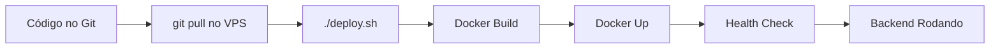
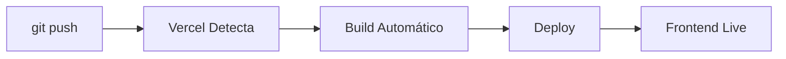

# Infraestrutura - BoraEntregar

## 📁 Estrutura de Arquivos Criada

```
BoraEntregar/
├── backend/
│   ├── src/
│   ├── Dockerfile                 # ✅ NOVO - Build da imagem Docker
│   ├── .dockerignore             # ✅ NOVO - Arquivos ignorados no build
│   ├── package.json
│   └── .env                      # Configure com suas credenciais
│
├── frontend/
│   ├── src/
│   ├── vercel.json               # ✅ NOVO - Configuração Vercel
│   ├── .env.example              # ✅ NOVO - Template de variáveis
│   ├── .env                      # Configure com suas credenciais
│   └── package.json
│
├── nginx/
│   ├── nginx.conf                # ✅ NOVO - Configuração principal
│   ├── conf.d/
│   │   └── boraentregar.conf     # ✅ NOVO - Config dos backends
│   ├── ssl/                      # Certificados SSL (não commitado)
│   └── logs/                     # Logs do Nginx (não commitado)
│
├── docker-compose.yml            # ✅ NOVO - Orquestração dos containers
├── .env.example                  # ✅ NOVO - Template de variáveis
├── .env                          # Configure com suas credenciais
├── deploy.sh                     # ✅ NOVO - Script de deploy automatizado
├── setup-vps.sh                  # ✅ NOVO - Setup inicial do VPS
├── DEPLOYMENT.md                 # ✅ NOVO - Guia completo de deploy
├── DEPLOY-QUICK-START.md         # ✅ NOVO - Guia rápido
├── INFRASTRUCTURE.md             # ✅ NOVO - Este arquivo
└── .gitignore                    # ✅ ATUALIZADO - Ignorar arquivos sensíveis
```

## 🏗️ Arquitetura de Deploy

### Diagrama de Infraestrutura

```
┌─────────────────────────────────────────────────────────────┐
│                        INTERNET                             │
└──────────────┬──────────────────────────┬───────────────────┘
               │                          │
               │                          │
    ┌──────────▼──────────┐    ┌─────────▼────────────┐
    │   Vercel (CDN)      │    │  Hetzner VPS         │
    │                     │    │  (Servidor Ubuntu)   │
    │  ┌──────────────┐   │    │                      │
    │  │  Frontend    │   │    │  ┌────────────────┐  │
    │  │  (React +    │◄──┼────┼─►│   Nginx        │  │
    │  │   Vite)      │   │    │  │  (Port 80/443) │  │
    │  └──────────────┘   │    │  └────────┬───────┘  │
    │                     │    │           │          │
    │  Branch: main       │    │  ┌────────▼───────┐  │
    │  URL: prod.app      │    │  │                │  │
    │                     │    │  │  Docker        │  │
    │  ┌──────────────┐   │    │  │  Compose       │  │
    │  │  Frontend    │   │    │  │                │  │
    │  │  Dev         │◄──┼────┼─►│  ┌──────────┐  │  │
    │  └──────────────┘   │    │  │  │ Backend  │  │  │
    │                     │    │  │  │   Main   │  │  │
    │  Branch: dev        │    │  │  │ (5001)   │  │  │
    │  URL: dev.app       │    │  │  └──────────┘  │  │
    └─────────────────────┘    │  │                │  │
                              │  │  ┌──────────┐  │  │
                              │  │  │ Backend  │  │  │
                              │  │  │   Dev    │  │  │
                              │  │  │ (5002)   │  │  │
                              │  │  └──────────┘  │  │
                              │  └────────────────┘  │
                              │                      │
                              │  Volumes:            │
                              │  - backend-uploads   │
                              └──────────────────────┘
                                         │
                                         │
                              ┌──────────▼──────────┐
                              │  MongoDB Atlas      │
                              │  (Cloud Database)   │
                              │                     │
                              │  - boraentregar-main│
                              │  - boraentregar-dev │
                              └─────────────────────┘
```

## 🐳 Containers Docker

### Backend Main (Produção)
```yaml
Container: boraentregar-backend-main
Port: 5001 (interno) → 5001 (host)
Network: boraentregar-network-main
Volume: backend-uploads-main
Branch: main
Environment: production
Database: boraentregar-main
```

### Backend Dev (Desenvolvimento)
```yaml
Container: boraentregar-backend-dev
Port: 5001 (interno) → 5002 (host)
Network: boraentregar-network-dev
Volume: backend-uploads-dev
Branch: dev
Environment: development
Database: boraentregar-dev
```

### Nginx (Reverse Proxy)
```yaml
Container: boraentregar-nginx
Ports: 80, 443
Networks: main + dev
Função: Load balancing, SSL, CORS
```

## 🌐 URLs e Portas

### Produção (Main)
| Serviço    | URL Externa                        | URL Interna        |
|------------|------------------------------------|--------------------|
| Frontend   | https://boraentregar.vercel.app    | N/A (Vercel)       |
| Backend    | https://api.seu-dominio.com        | backend-main:5001  |
| Direct     | http://SEU-IP-VPS:5001             | -                  |

### Desenvolvimento (Dev)
| Serviço    | URL Externa                        | URL Interna        |
|------------|------------------------------------|--------------------|
| Frontend   | https://boraentregar-dev.vercel.app| N/A (Vercel)       |
| Backend    | https://api-dev.seu-dominio.com    | backend-dev:5001   |
| Direct     | http://SEU-IP-VPS:5002             | -                  |

## 🔐 Variáveis de Ambiente

### Backend (.env na raiz)
```env
# MongoDB - Databases separados
MONGODB_URI_MAIN=mongodb+srv://...    # DB de produção
MONGODB_URI_DEV=mongodb+srv://...     # DB de dev

# Frontend URLs
FRONTEND_URL_MAIN=https://...         # URL Vercel produção
FRONTEND_URL_DEV=https://...          # URL Vercel dev

# Backend URLs
AUTH0_BASE_URL_MAIN=https://api...    # Seu domínio ou IP
AUTH0_BASE_URL_DEV=https://api-dev... # Seu domínio ou IP

# Auth0 (compartilhado)
AUTH0_CLIENT_ID=...
AUTH0_CLIENT_SECRET=...
AUTH0_ISSUER_BASE_URL=...
AUTH0_AUDIENCE=...
```

### Frontend - Main (Vercel)
```env
VITE_API_URL=https://api.seu-dominio.com
VITE_AUTH0_DOMAIN=...
VITE_AUTH0_CLIENT_ID=...
VITE_AUTH0_AUDIENCE=...
```

### Frontend - Dev (Vercel)
```env
VITE_API_URL=https://api-dev.seu-dominio.com
VITE_AUTH0_DOMAIN=...
VITE_AUTH0_CLIENT_ID=...
VITE_AUTH0_AUDIENCE=...
```

## 🔄 Fluxo de Deploy

### 1. Deploy Backend (VPS)



**Comandos:**
```bash
cd /opt/boraentregar
git pull origin main    # ou dev
./deploy.sh main        # ou dev
```

### 2. Deploy Frontend (Vercel)



**Comandos:**
```bash
git push origin main    # Deploy automático na Vercel
git push origin dev     # Deploy automático do dev
```

## 📊 Recursos do Servidor

### Requisitos Mínimos (VPS)
- **CPU**: 2 vCPUs
- **RAM**: 4GB
- **Storage**: 20GB SSD
- **Network**: 100 Mbps
- **OS**: Ubuntu 22.04 LTS

### Recursos Recomendados
- **CPU**: 4 vCPUs
- **RAM**: 8GB
- **Storage**: 40GB SSD
- **Network**: 1 Gbps

### Uso Estimado
```
Container          CPU    RAM     Storage
------------------------------------------------
backend-main       0.5    512MB   500MB (uploads)
backend-dev        0.3    512MB   500MB (uploads)
nginx              0.1    128MB   100MB (logs)
Total              ~1.0   ~1.2GB  ~1.1GB
------------------------------------------------
Sistema            0.5    1GB     5GB
TOTAL USADO        ~1.5   ~2.2GB  ~6GB
```

## 🔒 Segurança

### Firewall (UFW)
```bash
Port 22   → SSH (apenas seu IP)
Port 80   → HTTP (público)
Port 443  → HTTPS (público)
Port 5001 → Backend Main (bloqueado, via Nginx)
Port 5002 → Backend Dev (bloqueado, via Nginx)
```

### Docker Networks
- `boraentregar-network-main`: Isolada para produção
- `boraentregar-network-dev`: Isolada para desenvolvimento
- Nginx conecta em ambas as redes

### Volumes
- `backend-uploads-main`: Persistência de arquivos produção
- `backend-uploads-dev`: Persistência de arquivos dev
- Backups recomendados diariamente

## 📈 Monitoramento

### Health Checks
```bash
# Backend Main
curl http://localhost:5001/health

# Backend Dev
curl http://localhost:5002/health

# Nginx Status
docker-compose ps nginx
```

### Logs
```bash
# Todos os containers
docker-compose logs -f

# Backend específico
docker-compose logs -f backend-main

# Nginx
docker-compose exec nginx tail -f /var/log/nginx/access.log
```

### Métricas de Uso
```bash
# CPU, RAM, Network
docker stats

# Espaço em disco
df -h
docker system df
```

## 🔧 Manutenção

### Rotinas Diárias
- ✅ Monitorar logs de erro
- ✅ Verificar health checks
- ✅ Backup do banco de dados

### Rotinas Semanais
- ✅ Atualizar dependências (se necessário)
- ✅ Verificar espaço em disco
- ✅ Revisar logs do Nginx
- ✅ Limpar imagens Docker antigas

### Rotinas Mensais
- ✅ Atualizar sistema operacional
- ✅ Renovar certificados SSL
- ✅ Revisar configurações de segurança
- ✅ Testar backups

## 🚨 Disaster Recovery

### Backup Strategy

**1. Banco de Dados (Diário)**
```bash
# Automated via cron
0 2 * * * /opt/boraentregar/backup-db.sh
```

**2. Volumes Docker (Semanal)**
```bash
# Backup uploads
tar -czf uploads-backup.tar.gz /var/lib/docker/volumes/
```

**3. Configurações (No Git)**
```bash
# .env files (encrypted)
# nginx configs
# docker-compose.yml
```

### Recovery Plan

**1. Servidor Comprometido**
```bash
# Novo VPS
./setup-vps.sh
git clone ...
cp backups/.env .
./deploy.sh both
```

**2. Banco de Dados Corrompido**
```bash
# Restore do backup
mongorestore --uri="..." backup/
```

**3. Container Não Inicia**
```bash
docker-compose logs backend-main
docker-compose restart backend-main
# Se necessário, rebuild
./deploy.sh main
```

## 📞 Contatos e Links

### Serviços
- **VPS**: [Hetzner Cloud Console](https://console.hetzner.cloud)
- **Frontend**: [Vercel Dashboard](https://vercel.com/dashboard)
- **Database**: [MongoDB Atlas](https://cloud.mongodb.com)
- **Auth**: [Auth0 Dashboard](https://manage.auth0.com)

### Documentação
- [DEPLOYMENT.md](./DEPLOYMENT.md) - Guia completo
- [DEPLOY-QUICK-START.md](./DEPLOY-QUICK-START.md) - Início rápido
- [README.md](./README.md) - Documentação do projeto

### Monitoramento Recomendado
- [UptimeRobot](https://uptimerobot.com) - Monitoramento de uptime
- [Better Stack](https://betterstack.com) - Logs e alertas
- [Sentry](https://sentry.io) - Error tracking
- [Datadog](https://www.datadoghq.com) - APM (para escala)

## 🎯 Próximos Passos

- [ ] Configurar CI/CD com GitHub Actions
- [ ] Implementar cache com Redis
- [ ] Adicionar rate limiting
- [ ] Configurar alertas automáticos
- [ ] Implementar blue-green deployment
- [ ] Adicionar testes de carga
- [ ] Configurar CDN para assets
- [ ] Implementar logs centralizados
